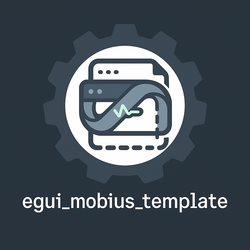

<div align="center">
  

# egui_mobius_template

*Scaffold your GUI software design on a single surface with two sides.*

[](https://github.com/saturn77/egui_mobius_template)
[](https://github.com/saturn77)

[](https://github.com/emilk/egui)
[](https://github.com/saturn77/egui_mobius_reactive)
[](https://github.com/saturn77/egui_mobius_widgets)
[](https://github.com/Veykril/egui_taffy)

</div>

A comprehensive collection of templates for building modern GUI applications with `egui` and `egui_mobius`. Each template demonstrates different architectural patterns to suit various application needs:

## Available Templates

### 1. Reactive Template (`examples/reactive`)
- Pure reactive architecture using `Dynamic<T>` and `Derived<T>`
- Best for: UI-focused applications with real-time state updates
- Features: Color picker, logging system, dockable panels

### 2. Reactive-Async Template (`examples/reactive-async`)
- Combines reactive patterns with async runtime integration
- Best for: Applications requiring background processing or I/O
- Features: All reactive features plus `MobiusRuntime` integration

### 3. Signal-Slots Template (`examples/signal-slots`)
- Event-driven architecture for heavy processing
- Best for: CPU-intensive applications, complex data processing
- Features: Signal-slot pattern for decoupled communication

A comprehensive template for building modern, reactive GUI applications with `egui` and `egui_mobius`. This template demonstrates best practices for creating responsive, thread-aware applications using the powerful features of the `egui_mobius` framework.

## Getting Started

1. Clone this template:
   ```bash
   git clone https://github.com/saturn77/egui_mobius_template.git
   cd egui_mobius_template
   ```

2. Build the examples:
   ```bash
   # Build all examples
   cargo build --examples
   ```

3. Try out the examples:
   ```bash
   # Basic reactive UI demo
   cargo run --example reactive
   
   # Async task handling demo
   cargo run --example reactive-async
   
   # RLC Circuit Simulator
   cargo run --example signals-slot
   ```

## Project Structure

```
├── src/                    # Core library code
│   └── lib.rs             # Main library interface
└── examples/
    ├── reactive/          # **Reactive** - Basic reactive UI demo
    │   ├── src/
    │   │   ├── main.rs    # Application entry
    │   │   ├── assets/    # Static resources
    │   │   └── ui/        # UI components
    │   └── README.md      # Example documentation
    ├── reactive-async/    # **Reactive-Async** sophisticated task handling demo
    │   ├── src/
    │   │   ├── main.rs    # Application entry
    │   │   ├── assets/    # Static resources
    │   │   └── ui/        # UI components
    │   └── README.md      # Example documentation
    └── signals-slot/      # **Signals-Slots** - RLC Circuit Simulator
        ├── src/
        │   ├── main.rs    # Application entry
        │   ├── circuit.rs # Circuit simulation
        │   ├── state.rs   # App state management
        │   ├── types.rs   # Data structures
        │   ├── slots/     # Signal-slot handlers
        │   └── ui/        # UI components
        └── README.md      # Example documentation
```

## Dependencies

- `egui` - Immediate mode GUI framework
- `egui_mobius` - Reactive programming framework
- `egui_dock` - Docking system for panel management
- `serde` - Serialization for settings
- `once_cell` - Static initialization

## Contributing

This template is maintained by Saturn Rocket Company. Feel free to open issues or submit pull requests if you have suggestions for improvements.

## License

This project is licensed under the MIT License - see the LICENSE file for details.
