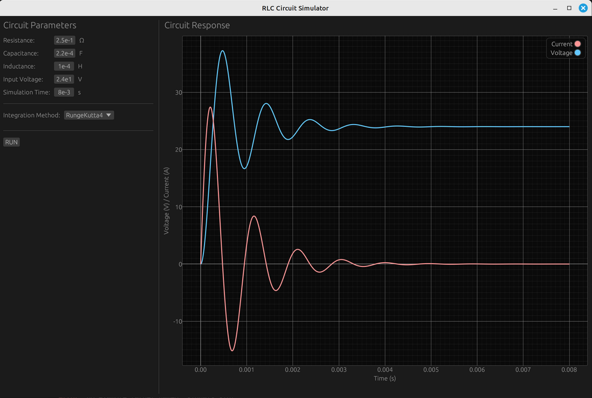

# RLC Circuit Simulator with Signal-Slot Architecture

This example demonstrates how to build a powerful signal-slot based application using the egui_mobius framework. It implements an interactive RLC circuit simulator where circuit parameters are connected to real-time simulation and visualization through a signal-slot mechanism.



## Features

1. **Scientific Parameter Input**
   - Support for scientific notation (e.g., 1e-6 F for capacitance)
   - Base unit display (Ω, F, H) without prefixes
   - Real-time validation and error handling

2. **Robust State Management**
   - Proper simulation state transitions (Ready → Running → Complete)
   - Error recovery and automatic state reset
   - Clear feedback on simulation status

3. **Signal-Slot Architecture Benefits**
   - Heavy simulation runs in a separate slot
   - UI remains responsive during computation
   - Clean error propagation through signal-slot channels
   - Automatic UI updates on parameter changes

4. **Numerical Integration**
   - Choice of numerical solvers:
     * Euler method - efficient for quick simulations
     * RK4 - higher accuracy, important for extended runs
     * Trapezoidal - stable for large timesteps
   - Solver selection most relevant for:
     * Long-running simulations (>100k steps)
     * High-precision requirements
     * Complex resonant behavior
   - Configurable parameters with real-time feedback

5. **Performance Optimizations**
   - Pre-allocated ndarray buffers for numerical computation
   - Efficient memory management with Vec capacity hints
   - Zero-copy data transfer between simulation and UI
   - Smart data downsampling for plot rendering
   - Minimal allocations during simulation loops

## Technical Features

1. **Interactive Circuit Parameters**
   - Adjustable resistance (R), inductance (L), and capacitance (C)
   - Multiple integration methods (Euler, RK4, Trapezoidal)
   - Real-time validation and error handling

2. **Advanced Visualization**
   - Real-time voltage and current waveforms
   - Interactive plot with zoom and pan
   - Color-coded traces for voltage and current

3. **Performance Optimizations**
   - Computation runs in dedicated slot
   - Efficient ndarray-based simulation
   - Smart update scheduling to prevent redundant calculations

## Framework Integration

1. **egui_mobius** (core)
   - Manages signal-slot connections
   - Handles computation scheduling
   - Ensures thread-safe data flow

2. **egui_mobius_reactive**
   - Updates plot data reactively
   - Manages parameter state
   - Handles computation results

3. **egui_mobius_widgets**
   - Parameter input controls
   - Plot widget integration
   - Status indicators

## Architecture

The application follows a clean signal-slot architecture:

- `main.rs`: Application setup and UI layout
- `circuit.rs`: RLC circuit simulation engine
- `state.rs`: Application state and reactive bindings
- `ui/`: UI components and parameter controls
- `slots/`: Computation slot implementation

## Running the Example

```bash
cargo run --example signals-slot
```

This example serves as a template for building computationally intensive applications with responsive UIs using the egui_mobius framework's signal-slot system.
